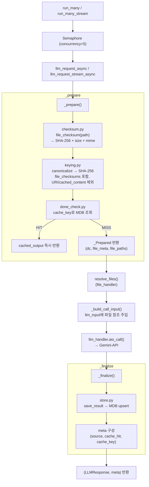
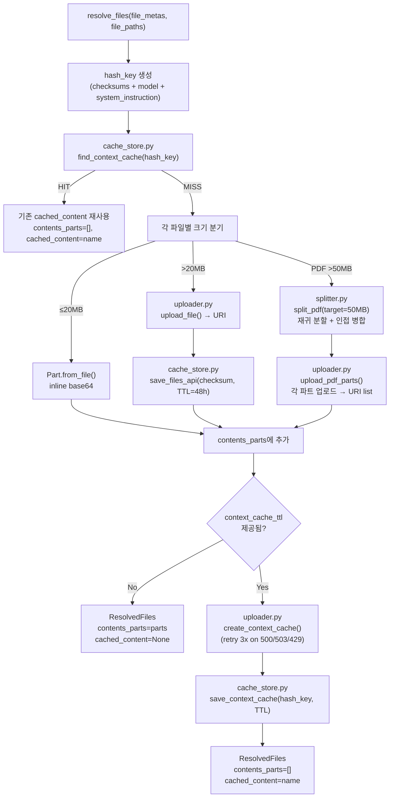

# llm-request 아키텍처 다이어그램

## 1. llm-request 전체 흐름

```mermaid
flowchart TD
    Entry["llm_request_async / llm_request_stream_async"]
    BatchEntry["run_many / run_many_stream"]

    BatchEntry --> Sem["Semaphore (concurrency=5)"]
    Sem --> Entry

    Entry --> Prepare["_prepare()"]

    subgraph _prepare
        Prepare --> CK["checksum.py<br/>file_checksum(path)<br/>→ SHA-256 + size + mime"]
        CK --> Keying["keying.py<br/>canonicalize → SHA-256<br/>file_checksums 포함, URI/cached_content 제외"]
        Keying --> DC["done_check.py<br/>cache_key로 MDB 조회"]
        DC -->|HIT| Fast["cached_output 즉시 반환"]
        DC -->|MISS| Prepared["_Prepared 반환<br/>(dc, file_meta, file_paths)"]
    end

    Prepared --> FH["resolve_files()<br/>(file_handler)"]
    FH --> Build["_build_call_input()<br/>llm_input에 파일 참조 주입"]
    Build --> Call["llm_handler.aio_call()<br/>→ Gemini API"]
    Call --> Finalize["_finalize()"]

    subgraph _finalize
        Finalize --> Save["store.py<br/>save_result → MDB upsert"]
        Save --> Meta["meta 구성<br/>(source, cache_hit, cache_key)"]
    end

    Meta --> Return["(LLMResponse, meta) 반환"]
```

## 2. file-handler 상세

```mermaid
flowchart TD
    Start["resolve_files(file_metas, file_paths)"]
    Start --> HashKey["hash_key 생성<br/>(checksums + model + system_instruction)"]
    HashKey --> RedisCheck["cache_store.py<br/>find_context_cache(hash_key)"]

    RedisCheck -->|HIT| Reuse["기존 cached_content 재사용<br/>contents_parts=[], cached_content=name"]

    RedisCheck -->|MISS| Loop["각 파일별 크기 분기"]

    Loop -->|"≤20MB"| Inline["Part.from_file()<br/>inline base64"]
    Loop -->|">20MB"| FilesAPI["uploader.py<br/>upload_file() → URI"]
    Loop -->|"PDF >50MB"| Split["splitter.py<br/>split_pdf(target=50MB)<br/>재귀 분할 + 인접 병합"]
    Split --> UploadParts["uploader.py<br/>upload_pdf_parts()<br/>각 파트 업로드 → URI list"]

    Inline --> Collect["contents_parts에 추가"]
    FilesAPI --> SaveFA["cache_store.py<br/>save_files_api(checksum, TTL=48h)"]
    SaveFA --> Collect
    UploadParts --> Collect

    Collect --> TTLCheck{"context_cache_ttl\n제공됨?"}
    TTLCheck -->|No| Direct["ResolvedFiles<br/>contents_parts=parts<br/>cached_content=None"]
    TTLCheck -->|Yes| CreateCache["uploader.py<br/>create_context_cache()<br/>(retry 3x on 500/503/429)"]
    CreateCache --> SaveCC["cache_store.py<br/>save_context_cache(hash_key, TTL)"]
    SaveCC --> Cached["ResolvedFiles<br/>contents_parts=[]<br/>cached_content=name"]
```
