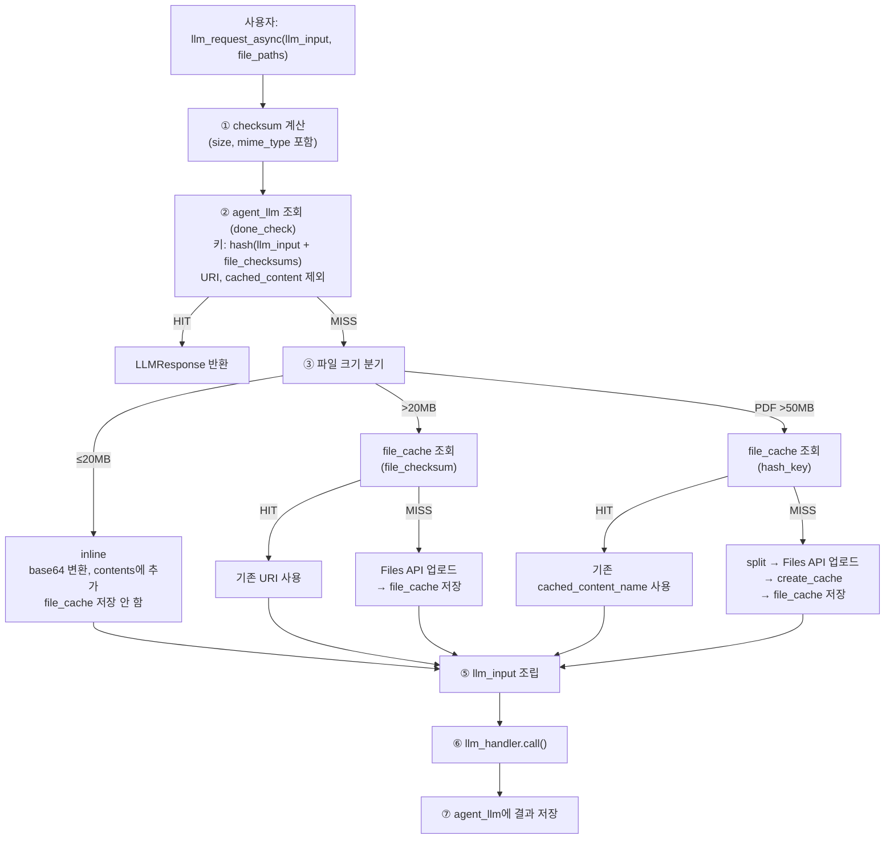
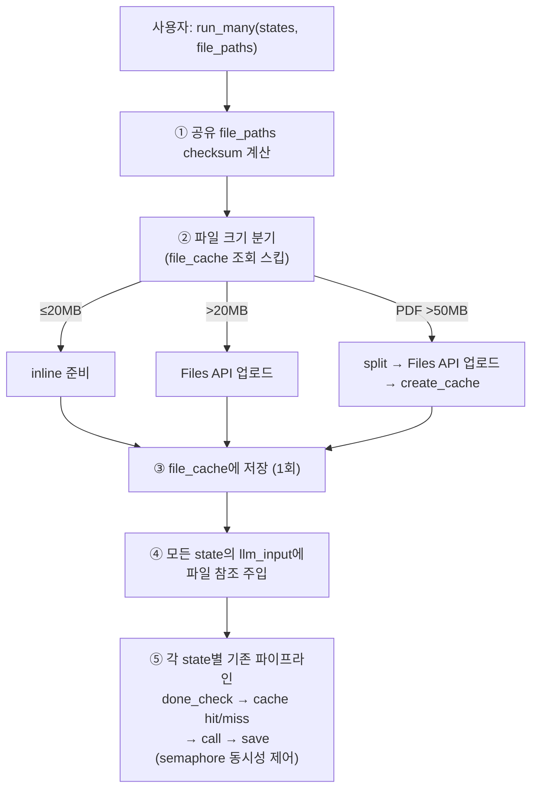

# 파일 처리 파이프라인 아키텍처

## 단건 호출 (llm_request_async)

```mermaid
flowchart TD
    Start["사용자: llm_request_async(llm_input, file_paths)"] --> CS["① checksum 계산<br/>(size, mime_type 포함)"]
    CS --> AgentLLM["② agent_llm 조회 (done_check)<br/>키: hash(llm_input + file_checksums)<br/>URI, cached_content 제외"]
    AgentLLM -->|HIT| Return["LLMResponse 반환"]
    AgentLLM -->|MISS| SizeBranch["③ 파일 크기 분기"]

    SizeBranch -->|"≤20MB"| Inline["inline<br/>base64 변환, contents에 추가<br/>file_cache 저장 안 함"]
    SizeBranch -->|">20MB"| FC1["file_cache 조회<br/>(file_checksum)"]
    SizeBranch -->|"PDF >50MB"| FC2["file_cache 조회<br/>(hash_key)"]

    FC1 -->|HIT| URI1["기존 URI 사용"]
    FC1 -->|MISS| Upload1["Files API 업로드<br/>→ file_cache 저장"]

    FC2 -->|HIT| Cache1["기존 cached_content_name 사용"]
    FC2 -->|MISS| Split["split → Files API 업로드<br/>→ create_cache<br/>→ file_cache 저장"]

    Inline --> Assemble["⑤ llm_input 조립"]
    URI1 --> Assemble
    Upload1 --> Assemble
    Cache1 --> Assemble
    Split --> Assemble

    Assemble --> Call["⑥ llm_handler.call()"]
    Call --> Save["⑦ agent_llm에 결과 저장"]
```

## 배치 호출 (run_many)

```mermaid
flowchart TD
    Start2["사용자: run_many(states, file_paths)"] --> CS2["① 공유 file_paths checksum 계산"]
    CS2 --> Size2["② 파일 크기 분기<br/>(file_cache 조회 스킵)"]

    Size2 -->|"≤20MB"| Inline2["inline 준비"]
    Size2 -->|">20MB"| Upload2["Files API 업로드"]
    Size2 -->|"PDF >50MB"| Split2["split → Files API 업로드<br/>→ create_cache"]

    Inline2 --> SaveFC["③ file_cache에 저장 (1회)"]
    Upload2 --> SaveFC
    Split2 --> SaveFC

    SaveFC --> Inject["④ 모든 state의 llm_input에<br/>파일 참조 주입"]
    Inject --> Pipeline["⑤ 각 state별 기존 파이프라인<br/>done_check → cache hit/miss<br/>→ call → save<br/>(semaphore 동시성 제어)"]
```
